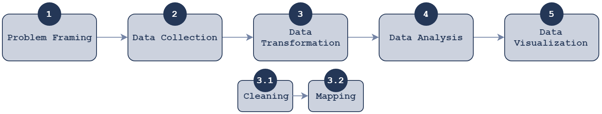

*You should use this boilerplate to start a new data analysis project*

*Please, remove theses two lines and adapt this file to fit with your project's specifications*

# Project Title

Add your one-paragraph project description here

## Project Structure

- `./1-Data/` contains the **project's data** (see folder [documentation](./1-Data/))
- `./2-Scripting/` contains **project's scripts** (see folder [documentation](./2-Scripting/))
- `./3-Deliverables/` contains the **project's deliverables** (see folder [documentation](./3-Deliverables/))

## Project Workflow

A data analysis project is described by these 5 major steps:

### 1 - Project Framing

Project framing consists in defining the goals and designing the strategy to reach these goals, taking into account contextual constraints.

### 2 - Data Collection

Data collection consists in gathering the data stored into an external source.
This source can be the client's IT system, a website, or any data source.

### 3 - Data Transformation

Data transformation consists in 2 steps:
- clearing the data
- mapping the data to a model

### 4 - Data Analysis

Data analysis consists in explaining, using the data, the underlying phenomenon.

### 5 - Data Visualization

Data visualization consists in making the finding of the previous step understandable to a non data scientist.